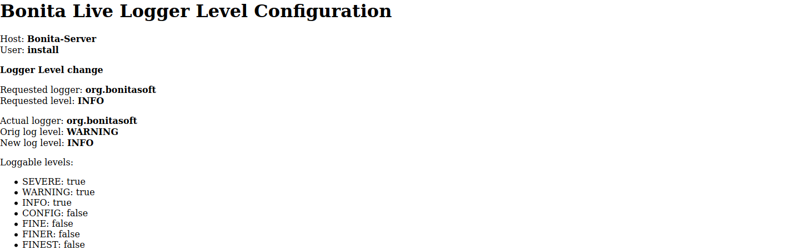

# bonita-tooling-live-log-configuration

Configure Bonita logger level in live environment

- [Context]()
- [Update with JSP](#jsp)

# Context

The Bonita Tomcat Bundle uses [JULI](https://tomcat.apache.org/tomcat-8.5-doc/logging.html) and loggers are configured
with the `logging.properties` configuration file.   
Logger level change can only be done by updating the configuration file and restarting Bonita. This is particularly
painful in large deployment where the server can take minutes to restart, degrading the feedback loop of the change.


The tools of this repository allow to configure logger level without configuration change nor Bonita restart by
providing
- logger name
- logger level, see [JUL Level](https://docs.oracle.com/javase/8/docs/api/java/util/logging/Level.html) for valid values

They have been tested with Bonita 7.8.4 Enterprise but should work with 7.7+ and Community edition.


**Note**: not tested with the Bonita Wildfly Bundle, it may works with minor adjustments


# <a name="jsp"></a> The jsp (uggly) way

Not recommended but this is the fastest way especially during development.

**IMPORTANT**: be aware that the jsp is not secured, which means that anybody knowning the path to the page can update
the log levels of your Bonita Runtime.

## Installation

### Development environment

Copy the [logs.jsp](jsp/logs.jsp) file directly in the `BONITA_INSTALLATION_DIRECTORY/server/webapps/bonita` directory.

### Other environments

In your `BONITA_INSTALLATION_DIRECTORY/server/webapps/bonita` create a folder which a random name (this is a poor way to
obfuscate the place where the admin page is located). On development environment, you cas skip the folder creation

For instance `lCsjYSTZAEdhnQ7GCl3/QMmRhhkDp8USR5f0fzf` (DO NOT this path, create your own)


## Usage

Do a HTTP GET on the `logs.jsp` page  with parameters
- `loggerName`: full name of the logger whose you want to update the level
- `loggerLevel`: level of the logger to be updated

For instance, using the path provided as example in the installation section: http://localhost:8080/bonita/lCsjYSTZAEdhnQ7GCl3/QMmRhhkDp8USR5f0fzf/logs.jsp?loggerName=com.bonitasoft.message.MyLogger&loggerLevel=FINE

The page displays information about the current logger settings and the new settings after changes




In the bonita.log, you will see something like
```
2020-02-18 15:26:16.602 +0100 FINE: com.bonitasoft.message.MyLogger ADMIN: new level set
```
