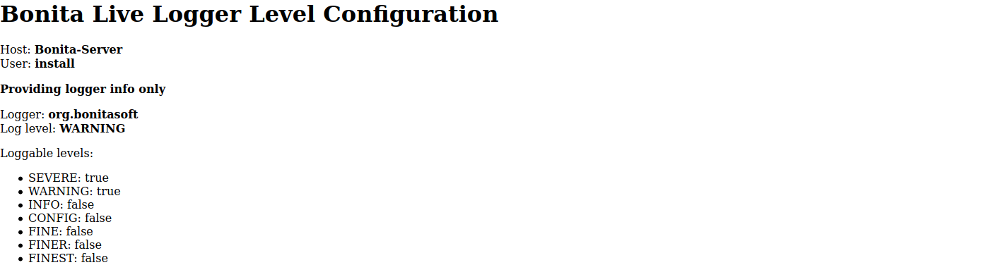

# bonita-tooling-live-log-configuration

Configure Bonita logger level in live environment

- [Context](#context)
- [Contributing and Support](#contributing)
- [Update with JSP](#jsp)

# Context

The Bonita Tomcat Bundle uses [JULI](https://tomcat.apache.org/tomcat-8.5-doc/logging.html) and loggers are configured
with the `logging.properties` configuration file.   
Logger level change can only be done by updating the configuration file and restarting Bonita. This is particularly
painful in large deployment where the server can take minutes to restart, degrading the feedback loop of the change.


The tools of this repository allow to configure logger level without configuration change nor Bonita restart by
providing
- logger name
- logger level, see [JUL Level](https://docs.oracle.com/javase/8/docs/api/java/util/logging/Level.html) for valid values

Also remember that depending of the configuration, logs message are written in the bonita.log or catalina.log
regarding the log handler loggers are associated to. 


Tools have been tested with Bonita 7.8.4 Enterprise but should Bonita Community edition and with other versions (at
least for Bonita bundles using Tomcat 8.5, so from Bonita 7.6.x to 7.11.x).


**Note**: not tested with the Bonita Wildfly Bundle, it may works with minor adjustments. See [#2](https://github.com/bonitasoft-labs/bonita-tooling-live-log-configuration/issues/2)


# <a name="contributin"></a> Contributing and Support

Use the GitHub issues of this repository for any question, bug, feature and enhancement request

Before submitting a Pull Request, please first open an issue for discussion (except for minor changes like typo fix
for instance)


# <a name="jsp"></a> The jsp way

Advantages
- easy installation
- easy customization
- easy live update

Cons
- authorization managed directly in the jsp, so be careful when changing it
- boiler plate code


## Installation

### Development environment

Copy the [logs.jsp](jsp/logs.jsp) file directly in the `BONITA_INSTALLATION_DIRECTORY/server/webapps/bonita` directory.

### Other environments

In your `BONITA_INSTALLATION_DIRECTORY/server/webapps/bonita` create a folder which a random name (this is a poor way to
obfuscate the place where the admin page is located). On development environment, you can skip the folder creation

For instance `lCsjYSTZAEdhnQ7GCl3/QMmRhhkDp8USR5f0fzf` (DO NOT USE this path, create your own).

Copy the [logs.jsp](jsp/logs.jsp) in the newly created folder.


## Usage

**Authorization**: you must be logged to Bonita as `Tenant Administrator` or have the `Administrator` profile to
access to the page

### Update log level

Do a HTTP GET on the `logs.jsp` page  with parameters
- `loggerName`: full name of the logger whose you want to update the level
- `loggerLevel`: level of the logger to be updated (if the )

For instance, using the path provided as example in the installation section: http://localhost:8080/bonita/lCsjYSTZAEdhnQ7GCl3/QMmRhhkDp8USR5f0fzf/logs.jsp?loggerName=com.bonitasoft.message.MyLogger&loggerLevel=FINE

The page displays information about the current logger settings and the new settings after changes


### Get Current Logger Level configuration

In this mode, you don't update the logger level but only get the current configuration and the effective levels that
are loggable

Do a HTTP GET on the `logs.jsp` page  with parameters
- `loggerName`: full name of the logger whose you want to known the level configuration





### Audit

In the bonita.log, an audit log is always written when the page is accessed like
```
2020-02-25 06:40:15.789 +0100 INFO: org.bonitasoft.tooling.log.jsp User 'install' accessed to the Logger Level configuration - Information only
2020-02-25 06:41:45.462 +0100 INFO: org.bonitasoft.tooling.log.jsp User 'install' set the log level of logger org.bonitasoft from WARNING to INFO
```
Or in case of unauthorized access
```
2020-02-25 06:39:55.820 +0100 WARNING: org.bonitasoft.tooling.log.jsp Unauthenticated user tried to access to the Logger Level configuration
2020-02-25 06:50:11.278 +0100 WARNING: org.bonitasoft.tooling.log.jsp Non Administrator 'user' user tried to access to the Logger Level configuration
```


### Known Limitations

Due to the way JULI manage classloaders, the tools of this repository are unable to get or update logger level of some
classes belonging to the Bonita Tenants.

In particular, for classes related to works, messages or connectors processing. For instance,
- `org.bonitasoft.engine.message`
- `org.bonitasoft.engine.execution.work.MessagesRestartHandler`
- `org.bonitasoft.engine.work` and `com.bonitasoft.engine.work`
